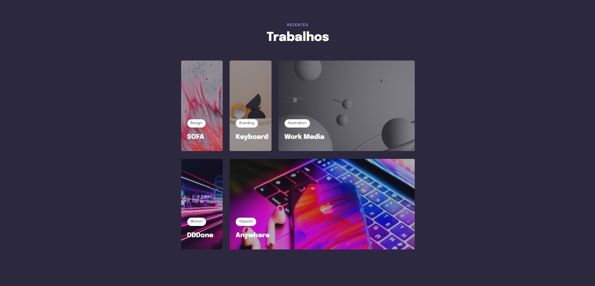

<h1 align="center"> Explorer (Stage 03) - CSS Avançado</h1>

Atividade da aula de CSS avançado.   

  <a href="#-tecnologias">Tecnologias</a>&nbsp;&nbsp;&nbsp;|&nbsp;&nbsp;&nbsp;
  <a href="#-projeto">Projeto</a>&nbsp;&nbsp;&nbsp;|&nbsp;&nbsp;&nbsp;
  <a href="https://gabriel-adsv.github.io/stage03-css-avancado-revisao/" target="_blank">Layout</a>&nbsp;&nbsp;&nbsp;|&nbsp;&nbsp;&nbsp;
  <a href="#memo-licença">Licença</a>

  

 

  

## 🚀 Tecnologias
Esse projeto foi desenvolvido com as seguintes tecnologias:
- HTML
- CSS

## 💻 Projeto
Para este projeto foram usadas:
- Variáveis de cores hsl e fontes no CSS
- Animação em CSS
- Responsividade
- Valor Clamp para as fontes
- E filtro de cor
- Display grid

[Acesse o projeto finalizado, online](https://gabriel-adsv.github.io/stage03-css-avancado-revisao/)

## 📝 Licença
Esse projeto está sob a licença MIT.

---
Feito com ♥ by Gabriel Augusto
